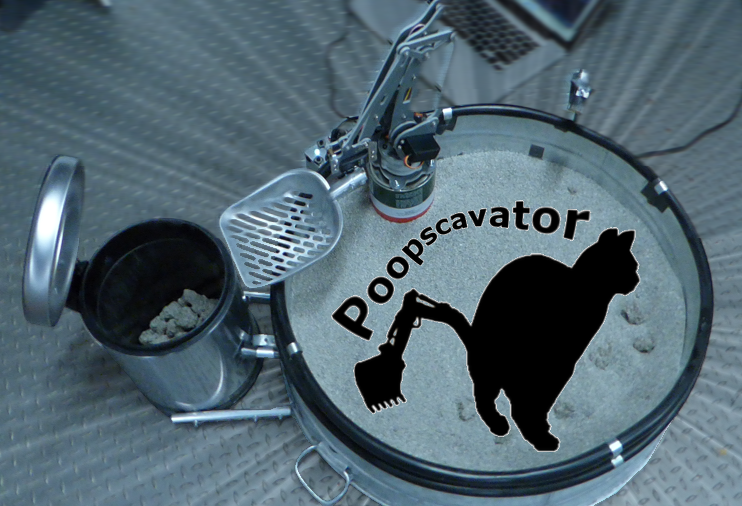

Poopscavator
============

[See it in action](https://youtu.be/kCbXBw0zStk)

Welcome to the Poopscavator project! Poopscavator is yet another attempt to automate the process
of cleaning up a cat litter bin. Also, it is an opportunity to gain exposure to some interesting technology:

The [Johnny5](https://github.com/rwaldron/johnny-five) javascript-based robotics framework 

The [SainSmart](http://www.sainsmart.com/diy-4-axis-servos-control-palletizing-robot-arm-model-for-arduino-uno-mega2560.html) 
palletizing robotic arm

A common cathode RGB Led

A passive infrared sensor

Getting started
========
There is no getting started for this project since the hardware setup was entirely ad hoc. 
Instead, this project aspires to provide code samples and introductory direction for johnny-five-based robotics projects.
Particularly, the SainSmart palletizing robotic arm.

